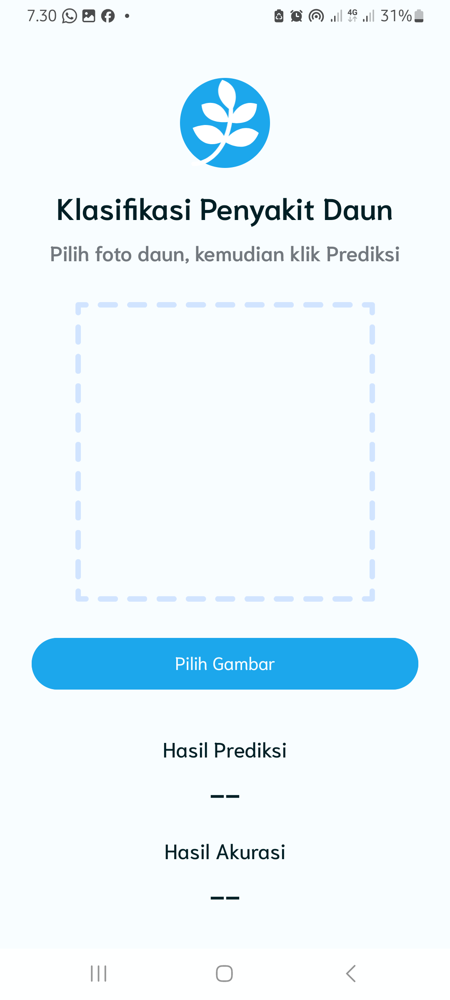
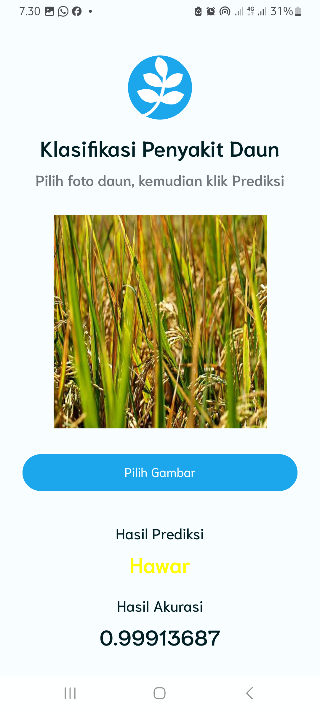
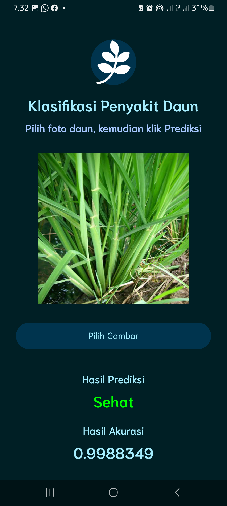

# 📱 LeafApp (Aplikasi Klasifikasi Penyakit Daun)

Aplikasi mobile sederhana untuk melakukan **klasifikasi penyakit daun** dengan implementasi tensorflowlite.  
Dibangun dengan **Kotlin**.

---

## 🚀 Features
- Klasifikasi penyakit daun
- Hasil confidence tingkat klasifikasi

---

## 🖼️ Screenshot
<p align="center">
  
  
  
</p>

---

## 🎥 Demo Video
<p align="center">
  <a href="https://drive.google.com/file/d/1SVyz6IUAEB9sLoyLphEYRExWru6Yuwsi/view?usp=sharing" target="_blank">
    
  </a>
</p>

---

## ⚙️ Tech Stack
- **Frontend (Mobile)**: Kotlin + Jetpack Compose + TensorFlow Lite
- **Model**:Model tensorflow klasifikasi penyakit daun

---

## 📦 Installation
```bash
# Clone repository
git clone https://github.com/AhmadSholehU/LeafApp.git

# Masuk ke folder project
cd LeafApp
```

---

## 👨‍💻 Author
- [Hendi Ahmad](https://github.com/AhmadSholehU)
